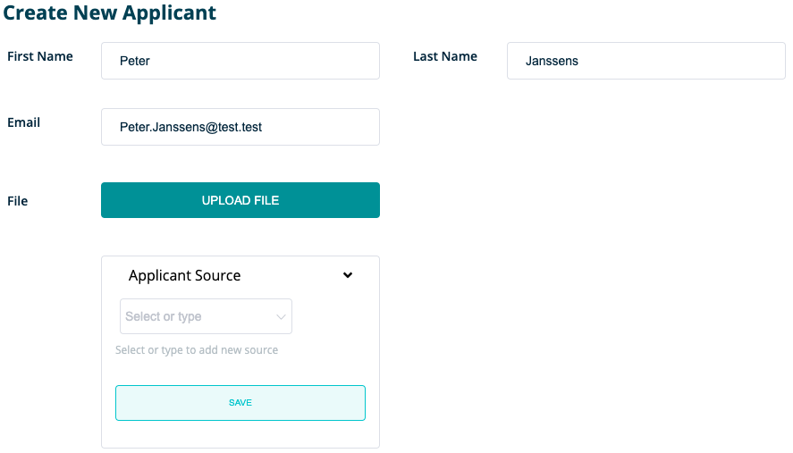
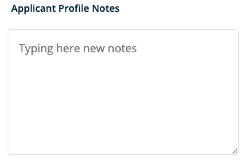
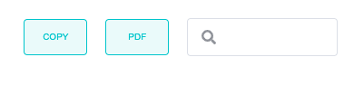

 

**Here you will find more detailed information about the ' Applicants ' section within RQRY.**



### New applicant

&nbsp; 

You can choose to add new candidates via both the dashboard and the applicant page.

&nbsp;   

&nbsp;   

**You can add the following information to the profile of the candidate:**

- First Name
- Last name
- E-mail address
- Extra documents such as motivation letters, certificates, CV, ...

- Source of recruitment: online advertisement, word-of-mouth marketing, acquaintance within the company, ...
You can add this yourself or you can click on a previous recruitment source.
- Applicant profile notes: do you have any comments for a colleague or as a reminder for yourself? Then add them here.

&nbsp;   

&nbsp;   

Have you entered the candidate's details correctly? Don't forget to click on **_'save applicant'_**.

&nbsp; 




### Add score for applicant
&nbsp; 
 
On this page you can score a candidate for your selected vacancy.

&nbsp;   

&nbsp;   

After selecting a vacancy, you have the option to choose the stage of the recruitment process
for which you want to score the candidate. Depending on the vacancy, different phases will be available.

&nbsp;   

&nbsp;   

**Once you have chosen the phase of the recruitment process, you can score the candidate on the different skills:**

- By hovering your mouse over the information sign at the top right of a skill, you can see what the behaviors
  and skills are of a high-performing worker for this skill.
- If you do not have enough knowledge about the presence or absence of a skill in an early phase,
  then leave the score in the middle: 4-6.
- You can then add a comment to the **_'Recruitment Process Notes'_**.
 stating that extra attention for this skill is required in a subsequent phase of the recruitment process.
- Don't forget to save your score.

&nbsp; 




### Applicant Results Detail
&nbsp; 

**By clicking on a candidate's profile, you will get a detailed overview of the following candidate data:**

&nbsp;   

&nbsp;   

- First name and surname
- E-mail address
- Source of recruitment
- Vacancies for which the candidate competes

**You will receive an overview of each vacancy for which the candidate has been scored:**

&nbsp;   

&nbsp;   

- The skills associated with the vacancy
- Scores in the different recruitment phases per vacancy
- Separate **_'Recruitment Process Notes'_** per vacancy

&nbsp;   

**You will be given the opportunity to:**

- Copy the summary table
- Search the score for a specific skill via the search bar
- Receive a report via **_'PDF'_** from the candidate for the selected vacancy

&nbsp;   

