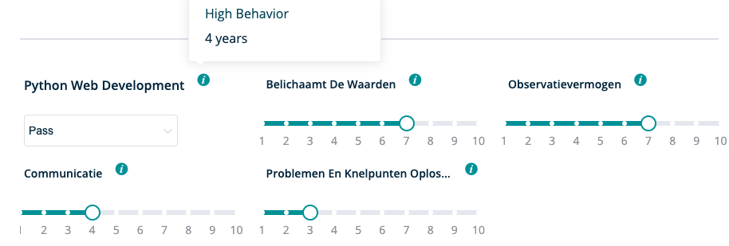

**Hier vind je uitgebreidere info over het onderdeel ' Applicants ' binnen RQRY.** 


### New applicant

&nbsp; 

Zowel via het dashboard als via de applicant pagina kan je kiezen om nieuwe kandidaten toe te voegen.

&nbsp;   

&nbsp;   

**Je kan volgende gegevens toevoegen aan het profiel van de kandidaat:**

- Voornaam
- Achternaam
- E-mailadres
- Extra documenten zoals motivatiebrieven, certificaten, cv,...

- Bron van rekrutering: online advertentie, word-of-mouth marketing, kennis binnen het bedrijf,...
Deze kan je zelf toevoegen of je kan een vorige rekruteringsbron aanklikken.
- Applicant profile notes: heb je nog bemerkingen voor een collega of als reminder voor jezelf? Voeg ze dan hier toe.

&nbsp;   

&nbsp;   

Heb je de gegevens van de kandidaat correct ingevuld? Vergeet dan niet op '_**save applicant**_' te klikken.



&nbsp; 


### Add Score For Applicant
&nbsp; 
 
Op deze pagina kan je een kandidaat scoren voor je geselecteerde vacature.

&nbsp;   

&nbsp;   

Nadat je een vacature hebt geselecteerd, heb je de mogelijkheid om de fase van het rekruteringsproces te kiezen
waarvoor je de kandidaat wil scoren. Afhankelijk van de vacature zullen er verschillende fases beschikbaar zijn.

&nbsp;   

&nbsp;   

**Eens je de fase van het rekruteringsproces hebt gekozen, kan je de kandidaat scoren op de verschillende skills:**

- Door met je muis over het informatietekentje rechtsboven een skill te zweven, kan je zien wat de gedragingen
  en vaardigheden van een hoogpresterende werknemer voor deze skill zijn. 
- Indien je nog niet genoeg kennis over de aan- of afwezigheid van een skill hebt in een vroege fase,
  laat de scoring dan in het midden staan: 4-6. 
- Je kan dan bij de '_**Recruitment Process Notes**_' een bemerking
  schrijven om extra aandacht te vereisen voor deze skill in een volgende fase van het rekruteringsproces.
- Vergeet je score niet op te slagen.


&nbsp; 


### Applicant Results Detail
&nbsp; 

**Door op het profiel van een kandidaat te drukken, krijg je een gedetailleerd overzicht van de volgende kandidaatgegevens:**

&nbsp;   

&nbsp;   

- Voornaam en achternaam
- E-mailadres
- Bron van rekrutering
- Vacatures waarvoor de kandidaat meedingt

**Per vacature waar de kandidaat is voor gescoord, krijg je een overzicht van:**

&nbsp;   

&nbsp;   

- De skills die bij de vacature horen
- Scores in de verschillende rekruteringsfases per vacature
- Aparte '_**Recruitment Process Notes**_' per vacature

&nbsp;   

**Je krijgt de mogelijkheid om:**

- De overzichtstabel te kopiëren
- Via de zoekbalk de score op een specifieke skill te zoeken
- Een verslag te krijgen via '_**PDF**_' van de kandidaat voor de geselecteerde vacature

&nbsp;   

