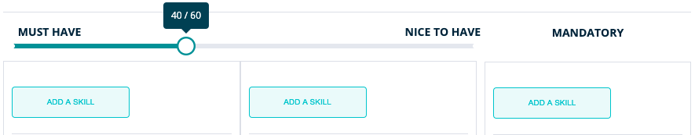

**Here you will find more detailed information about the ‘ Vacancies ’ section within RQRY.**


### Create New Vacancy
&nbsp; 

**You can create a new vacancy on this page:**
&nbsp; 

&nbsp; 

**Determine the content of your vacancy:**

- title
- status: _**open**_ , _**on hold**_ or _**closed**_
- Recruitment phases: If you want more phases than indicated here, you can drag a phase from the left column
  to the right column. If you want fewer phases, you can press the cross in the right column
  to delete the phase.

&nbsp; 

 

&nbsp; 

- Skills of the vacancy: '**_must have skills_**', '**_nice to have skills_**' and
  '**_mandatory skills_**'
- '**_must have skills_**': skills that are necessary for delivering good work performances
- '**_nice to have skills_**': skills that make the difference between good and excellent candidates, these are not
  necessary for the delivery of a good work performance but are used for ensuring differentiation between candidates
- '**_mandatory skills_**': skills that serve as a condition for being allowed or able to practice a profession
- Via the slider you can indicate to what extent you want the '**_must haves_** ' vs '**_nice to haves_**' to weigh on
  determining the fit between candidates and the vacancy
- Via '**_add a skill_**' you can add skills to the different categories of skills 

&nbsp; 

&nbsp; 

**After you have added skills to your vacancy, you still need to determine some crucial characteristics:**

&nbsp; 

- Categorize your skills: the column represents the category of skills, so make sure you have
  also categorized your '**_must haves_**' in the column of '**_must have skills_**'
- Indicate the relative importance of your skills per category: if you find a certain skill more important then
  another skill, you can indicate this by dragging it above the other skill. If you have skills, that are equally important
  you can indicate this by putting them below one another and indicating '**_Equal to the previous one_**'. 
- Per skill you must also indicate an expected score. This expected score reflects the desired level that candidates need to possess
  to have a chance of getting recruited

&nbsp; 

&nbsp; 

  
**_A few more important remarks with regard to vacancies:_**

&nbsp; 

 
- If you need to duplicate a vacancy (e.g. new solution consultant vacancy when this vacancy already exists),
  you can add extra information to the title of this vacancy (e.g. solution consultant HR department). If you don't, 
  RQRY will add the creation date of the vacancy to the title.
- Editing / updating a vacancy is done in the same way as creating a vacancy.
- To change a vacancy, to update it, ... you must first put the vacancy '**_on hold_**'. This is created so that you can be sure
that changes to your vacancy do not interfere with the recruitment process.
- Only vacancies that are '**_open_**' can receive candidate scores.
- Don't forget to save your vacancy.

&nbsp; 



### Vacancy details

&nbsp; 

&nbsp; 

 
You can reach this page by clicking on a vacancy in the overview of vacancies on the '**_Vacancies_**' page.
The '**_Vacancy Details_**' page gives you the opportunity to look at **2 overviews**.

&nbsp; 

 

&nbsp; 

 
1) The '**_Results_**' subpage gives you the opportunity to view the fit scores between the candidates and the vacancy per phase of the recruitment process.

&nbsp; 

 
   

&nbsp; 

 
- If you click on the arrow to the left of the candidate name, you can get a more extensive overview
  of the specific candidate scores that are listed per skill that you link to the vacancy. The scores on these skills form
  the basis for the fit score between the candidate and the vacancy.
- You can also view the scores per phase of the recruitment process. This will give you a detailed overview
 of a candidate, where you can check how the candidate is scored on a specific skill for the different recruitment phases.
 
 
&nbsp; 

 
 

&nbsp; 

 
- On the '**_Results_**' page you also have the option get a report of the fit scores for the various
recruitment phases via the '**_PDF_**' button. You can use this for internal communication concerning
the recruitment decision. Below you will find an example of this.

&nbsp; 

 
 

&nbsp; 

 
- Furthermore, on the '**_Results_**' page you have the option to edit both the scores and
  the status of the candidates.
- On the general page '**_Vacancy Details_**' you have several options: you can proceed to the simulations, you can choose
to edit the vacancy and you can also add scores to the candidates for the different recruitment phases.

&nbsp; 

 

2) The '**_Profile_**' subpage gives you an overview of how you have built the vacancy.

&nbsp; 

 

&nbsp; 

 

**You will be shown the following information:**

&nbsp; 

 
- Steps in the selection and recruitment process
- Names of the skills that make up the vacancy
- Category to which the skill belongs ('**_Mandatory_**', '**_Must Have_**', '**_Nice To Have_**')
- '**_Criticality_**': indicates the extent to which the certain category of skills weighs  on the
  determination of fit between candidate and vacancy (e.g. 40-60, 50-50, ...). This is the relative importance of the categories of skills between each other,
  the importance of the '**_must haves_**' vs '**_nice to haves_**'
- '**_Weight_**': indicates the relative importance of a skill within a certain category of skills, for example
  how strongly a certain skill counts in the '**_must haves_**'

&nbsp; 




### Simulation
&nbsp; 

**On this page you will receive 2 simulations that form the support engine for your recruitment process.**

&nbsp; 

 

1) '_**Visual Analysis**_': 

&nbsp; 

 

- A simulation showing the fit between the vacancy and a random sample of 100
  fictional candidates based on the scores on '**_must haves_**' and '**_nice to haves_**'. 

&nbsp; 

 

&nbsp; 

- This 'Visual Analysis' consists of green dots and blue dots. The green dots represent the sample of 100 random fictional candidates
  and the blue dots are the candidates you have added yourself.
- By hovering over a dot, you can see the fit of a specific candidate with the vacancy.
- If you click on a dot, you will get the "_**Skill profile scores for ...**_": this is a graph that shows what the
  desired scores are (orange) and what the scores of the selected candidate are (blue) for
  the skills of a vacancy.

&nbsp; 

 

&nbsp; 

 
  
2) '_**Impact Analysis**_': 

&nbsp; 

 

- This diagram displays the weights of the individual skills in the calculation of the fit
  between the candidate and the vacancy.

- By hovering over an element of the diagram you can see how much a specific skill weighs in the calculation of
  the fit between the candidate and the vacancy.
 
- Be sure to check this out to make sure the distribution reflects what the organizational needs are for the specific vacancy.

&nbsp; 

