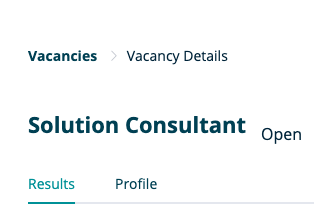
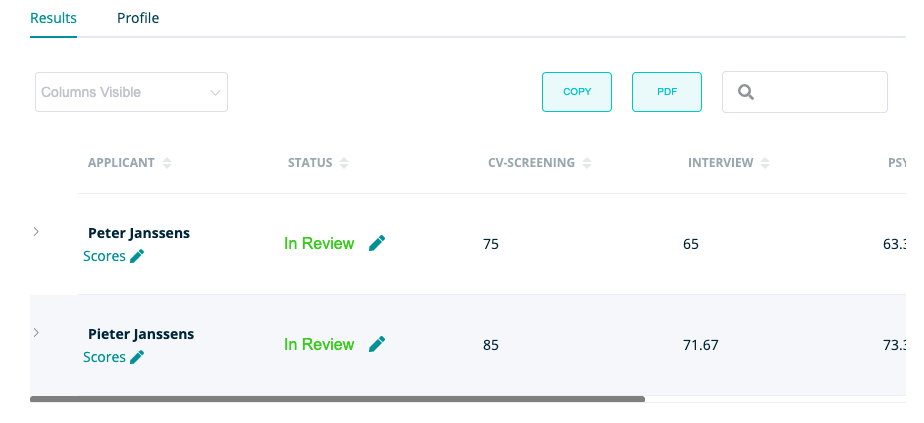
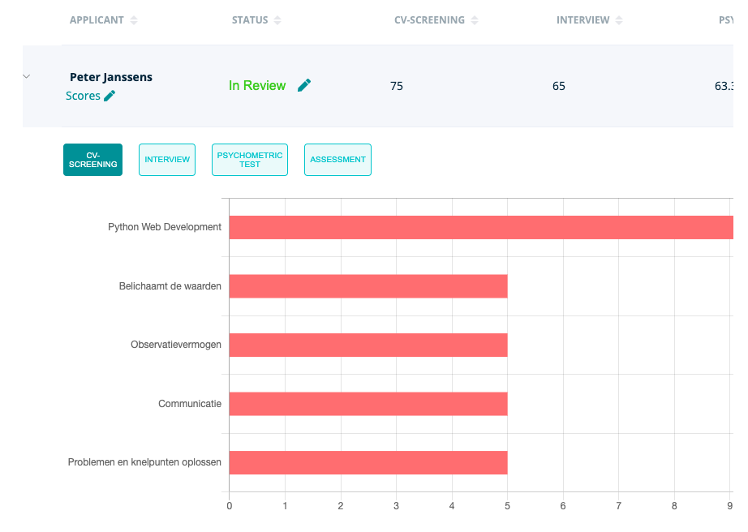
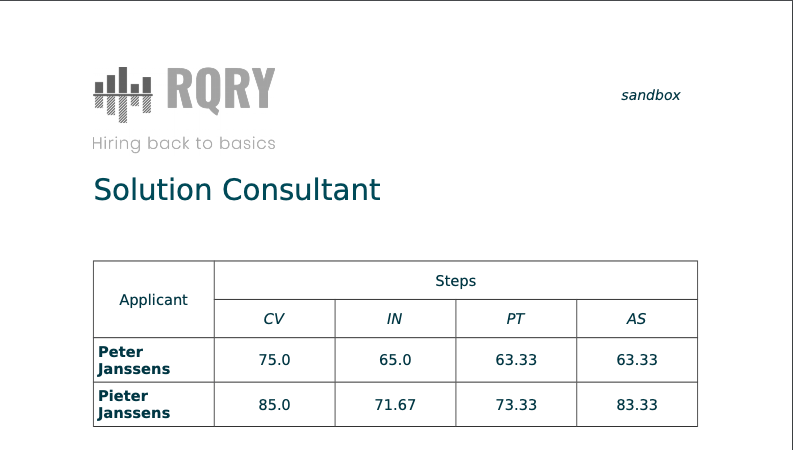
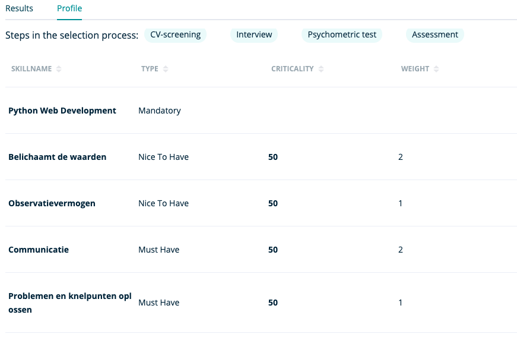
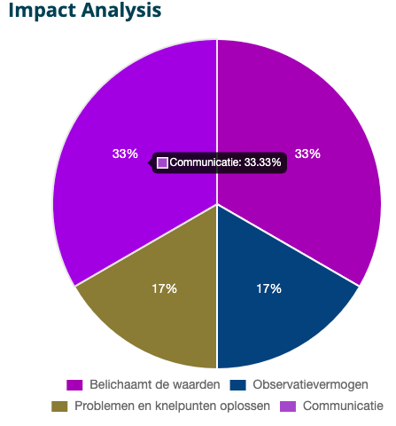

**Hier vind je uitgebreidere info over het onderdeel ' Vacancies ' binnen RQRY.**



### Create New Vacancy
&nbsp; 

**Op deze pagina maak je een nieuwe vacature aan:**
&nbsp; 

&nbsp; 

**Bepaal de inhoud van je vacature:**

- titel
- status: _**open**_, _**on hold**_ of _**closed**_
- Rekruteringsfases: Indien je meer fases wil dan hier aangegeven, kan je een fase van de linkerkolom
  naar de rechterkolom slepen. Indien je minder fases wil, kan je op het kruisje drukken in de rechterkolom
  om de fase te verwijderen.

&nbsp; 

 

&nbsp; 

 
- Skills van de vacature: '_**must have skills**_', '**_nice to have skills_**' en 
  '**_mandatory skills_**' 
- '**_must have skills_**': skills die noodzakelijk zijn voor het leveren van goede werkprestaties
- '**_nice to have skills_**': skills die het verschil maken tussen goede en uitstekende kandidaten, deze zijn niet 
  noodzakelijk voor het leveren van een goede werkprestatie maar zorgen voor differentiatie tussen kandidaten
- '_**mandatory skills**_': skills die dienen als voorwaarde om een beroep te mogen of kunnen uit te oefenen
- Via de slider kan je aangeven in welke mate je de '_**must haves**_' vs '_**nice to haves**_' wil laten doorwegen op 
  de fitbepaling tussen kandidaten en de vacature
- Via '_add a skill_' kan je skills toevoegen aan de verschillende categorieën van skills
&nbsp; 

&nbsp; 

**Nadat je skills hebt toegevoegd aan je vacature, moet je nog enkele cruciale kenmerken bepalen:**

&nbsp; 

- Categoriseer je skills: de kolom stelt de categorie van skills voor, dus zorg bijvoorbeeld dat je 
  je '**_must haves_**' ook categoriseert in de kolom van '_**must have skills**_'
- Geef per categorie het relatief belang van je skills aan: indien je een bepaalde skill belangrijker vindt dan
  een andere skill, kan je dit aangeven door deze erboven te slepen. Indien je skills hebt die relatief even belangrijk
  zijn, kan je dit aangeven door ze onder elkaar te zetten en '**_Equal to the previous one_**' aan te duiden.
- Per skill moet je ook een verwachte score aanduiden die het gewenste niveau weergeeft dat kandidaten
  moeten halen om een kans te maken op rekrutering.

&nbsp; 

&nbsp; 

  
**_Nog enkele belangrijke bemerkingen m.b.t. vacatures:_**

&nbsp; 

 

- Indien je een vacature moet dupliceren (Bv. nieuwe solution consultant vacature wanneer deze vacature al bestaat),
  kan je extra info toevoegen aan de titel van deze vacature (Bv. solution consultant afdeling HR). Indien je dit niet
  doet zal RQRY de aanmaakdatum van de vacature toevoegen aan de titel.
- Het bewerken/updaten van een vacature verloopt op dezelfde manier als het aanmaken van een vacature.
- Om een vacature te veranderen, up-to-date te brengen,... moet je de vacature eerst '_**on hold**_' zetten. Dit om tegen 
  te gaan dat veranderingen in je vacature interfereren met het rekruteringsproces.
- Enkel vacatures die '_**open**_' staan, kunnen kandidaatscores ontvangen.
- Vergeet je vacature niet op te slagen.

&nbsp; 





### Vacancy details

&nbsp; 

&nbsp; 

 

Deze pagina bereik je door te klikken op een vacature in het overzicht van de vacatures op de '_**Vacancies**_' pagina. 
De '_**Vacancy Details**_' pagina geeft je de mogelijkheid om **2 overzichten** te bekijken. 

&nbsp; 

 

&nbsp; 

 

1) De '**_Results_**' subpagina geeft je de mogelijkheid om per fase van het rekruteringsproces 
   de fitscores tussen de kandidaten en de vacature te bekijken. 

&nbsp; 

 
   

&nbsp; 

 
   
- Indien je op het pijltje links van de kandidaatnaam klikt, kan je een uitgebreider overzicht krijgen
  voor de kandidaatscores die staan opgelijst per skill die je linkt aan de vacature. De scores op deze skills vormen 
  de basis voor de fitscore tussen de kandidaat en de vacature. 
- De scores kan je ook per fase van het rekruteringsproces bekijken. Zo krijg je een gedetailleerd overzicht
 van een kandidaat waarbij je voor de verschillende rekruteringsfases kan nagaan hoe de kandidaat 
 scoort op een specifieke skill.
 
 
&nbsp; 

 
 

&nbsp; 

 

- Op de '_**Results**_' pagina heb je verder ook de mogelijkheid om een verslag van de fitscores voor de verschillende 
rekruteringsfases te krijgen via de '_**PDF**_' knop. Dit kan je gebruiken voor interne communicatie omtrent 
de rekruteringsbeslissing. Hieronder vind je hiervan een voorbeeld.

&nbsp; 

 
 

&nbsp; 

 

- Verder heb je op de '_**Results**_' pagina de optie om zowel de scores van de kandidaten als
  de status van de kandidaten te bewerken.
- Op de algemene pagina '**_Vacancy Details_**' kan je ook doorgaan naar de simulaties, ervoor kiezen 
om de vacature te bewerken en kan je scores toevoegen aan de kandidaten voor de verschillende rekruteringsfases.

&nbsp; 

 

2) De '**_Profile_**' subpagina geeft je een overzicht van hoe je de vacature hebt opgebouwd.

&nbsp; 

 

&nbsp; 

 

**Je krijgt de volgende gegevens weergegeven:**

&nbsp; 

 

- Stappen in het selectie- en rekruteringsproces
- Namen van de skills waaruit de vacature is opgebouwd
- Categorie waartoe de skill behoort ('_**Mandatory**_', '_**Must Have**_', '_**Nice To Have**_')
- '_**Criticality**_': geeft aan in welke mate de bepaalde categorie van skills doorweegt (bv 40-60, 50-50,...) op de 
  fitbepaling tussen kandidaat en vacature. Dit is het relatief belang van de categorieën van skills tussen elkaar,
  het belang van de '_**must haves**_' vs '_**nice to haves**_'
- '_**Weight**_': geeft aan wat het relatief belang is van een skill binnen een bepaalde categorie van skills, bijvoorbeeld
  hoe sterk een bepaalde skill doorweegt in de '_**must haves**_'

&nbsp; 




### Simulation
&nbsp; 

**Op deze pagina krijg je 2 simulaties die de ondersteuningsmotor vormen voor je rekruteringsproces.**

&nbsp; 

 

1) '_**Visual Analysis**_': 

&nbsp; 

 

- een simulatie die de fit weergeeft tussen de vacature en een steekproef van 100 willekeurige
  fictieve kandidaten op basis van de scores op '_**must haves**_' en '_**nice to haves**_'. 

&nbsp; 

 

&nbsp; 

- Deze 'Visual Analysis' bestaat uit groene bolletjes en blauwe bolletjes. De groene bolletjes stellen de steekproef van 100 willekeurig fictieve kandidaten voor
  en de blauwe bolletjes zijn de kandidaten die je zelf hebt toegevoegd.
- Door te zweven over een bolletje, zie je de fit van een specifieke kandidaat met de vacature.
- Indien je op een bolletje klikt, krijg je de "_**Skill profile scores for...**_": dit is een grafiek die weergeeft wat de 
  gewenste scores (oranje) zijn en wat de scores van de geselecteerde kandidaat zijn (blauw) voor 
  de skills van een vacature.

&nbsp; 

 

&nbsp; 

 
  
2) '_**Impact Analysis**_': 

&nbsp; 

 

- deze diagram geeft weer in welke mate de aparte skills doorwegen in het berekenen van de fit
  tussen de kandidaat en de vacature.

- Door te zweven over een element van de diagram kan je zien hoeveel een specifieke skill doorweegt in het berekenen van 
  de fit tussen de kandidaat en de vacature.
 
- Bekijk dit zeker om te controleren of de verdeling reflecteert wat de organisationele behoeften voor 
  de specifieke vacature inhouden.

&nbsp; 

