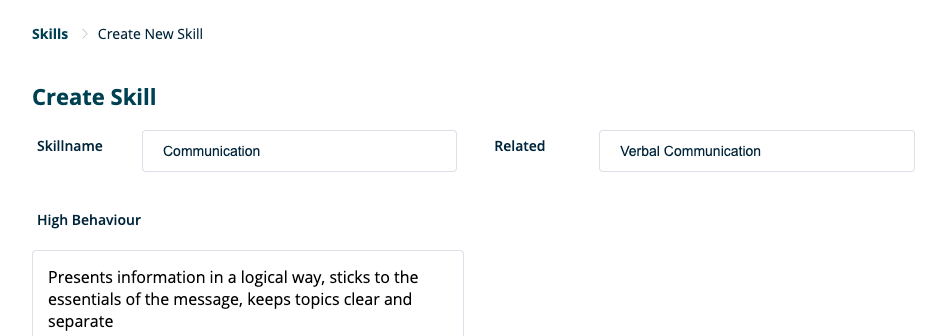
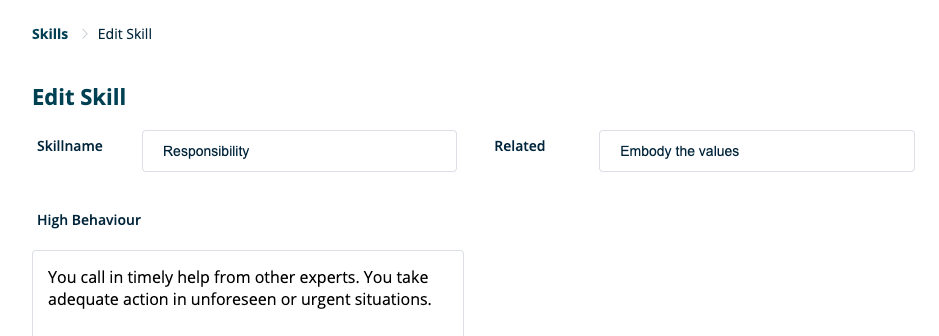

**Here you will find more detailed information about the ‘ Skills ’ section within RQRY.** 
&nbsp; 
  
    
  

### New Skills
&nbsp; 
  
  

&nbsp; 
  
  

On this page you can create a new skill. Therefore, you must enter the following information:
&nbsp; 
  
  
- Name of the skill
- Related skill: another skill that is closely related to the skill
- '_**High Behavior**_': behaviors and skills of high performing employees for this specific skill.
- Don't forget to save!

&nbsp; 
  
  
 

&nbsp; 
  
  

Editing/updating a skill is done in the same way as creating skills. Watch out for the following:

&nbsp; 
  
  

&nbsp; 
  
  
- Make sure your descriptions of the skill are clear and communicable to others.
- Skills can always be edited / updated, but beware of skills that are already in use within profiles
  of candidates. In the future, skills that are already in use will no longer be updatable.
- Don't forget to update.

