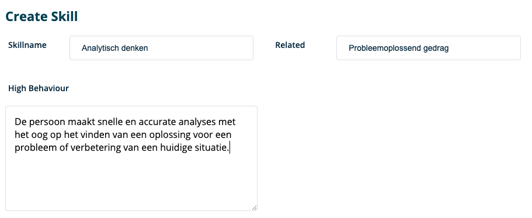
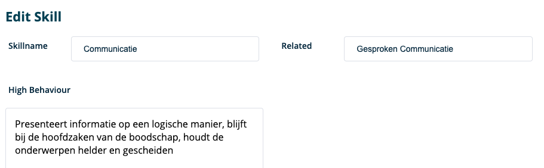

**Hier vind je uitgebreidere info over het onderdeel ' Skills ' binnen RQRY.**  
  

### New Skills
&nbsp; 
  
  

&nbsp; 
  
  

Op deze pagina maak je een nieuwe skill aan. Hierbij moet je volgende gegevens invoeren:
&nbsp; 
  
  

- Naam van de skill
- Gerelateerde skill: een andere skill die sterk samenhangt met de skill
- '_**High Behaviour**_': gedragingen en vaardigheden van hoogpresterende werknemers voor deze specifieke skill.
- Vergeet niet op te slagen
&nbsp; 
  
  
 

&nbsp; 
  
  

Het bewerken/updaten van een skill verloopt op dezelfde manier als het aanmaken van skills. Let wel op: 

&nbsp; 
  
  

&nbsp; 
  
  

- Zorg dat je beschrijvingen bij de skill duidelijk en helder communiceerbaar zijn naar anderen.
- Skills kunnen altijd bewerkt/geüpdatet worden maar pas op voor skills die al in gebruik zijn bij profielen
  van kandidaten. In de toekomst zullen skills die in gebruik zijn niet meer kunnen geüpdatet worden.
- Vergeet niet te updaten.

