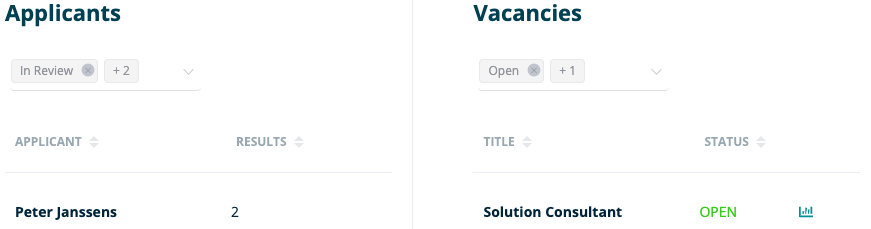
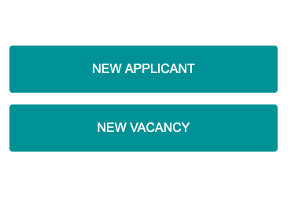
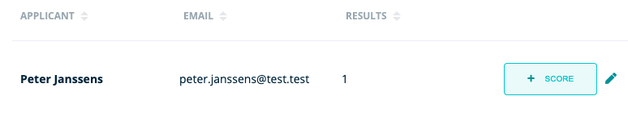
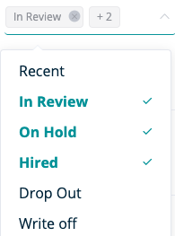
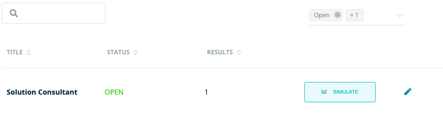
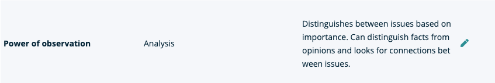

**On this page you will find a brief overview of the main features of RQRY**
 



  

**The dashboard gives you a quick overview of:**
  

  

- **Candidates**: You can organize the candidates by status (in review, on hold, ...) and you can see how many results of
the respective candidates are already included in RQRY.
  

- **Vacancies**: You can view the status (open, on hold, ..) of your specific vacancies and what you receive
 the ability to go directly to the simulation page for a specific job opening.
 
 
- Furthermore, you also get the option to add new candidates or vacancies directly from the dashboard
your organizational RQRY.
   





  
**The applicants page gives you a quick overview of:**

- First name and surname
- E-mail address
- Number of results per candidate

&nbsp;  

**You get the options on this page to:**
  
- Filter existing candidates by status
- Organize existing candidates by name, e-mail address and number of results
- Add new candidates
- Award existing candidates one or more scores
- Adjust the data of an existing candidate





  

  

**The vacancies page gives you a quick overview of:**
  

- Job titles
- Current status of the vacancy
- Total number of results per vacancy
  
&nbsp;  

**You get the options to:**
  

- Filter existing vacancies by status
- Organize existing vacancies by title, status and number of results
- Add new vacancies
- Make simulations for existing vacancies
- Editing and updating existing vacancies
  




 
  

&nbsp;  

**The skills page gives you a quick overview of:**

- Skill titles
- Related skills
- Behaviors and skills of high-performing employees

&nbsp;  

&nbsp;  

**You get the options to:**

- Add new skills
- Adjust existing skills

&nbsp;  



