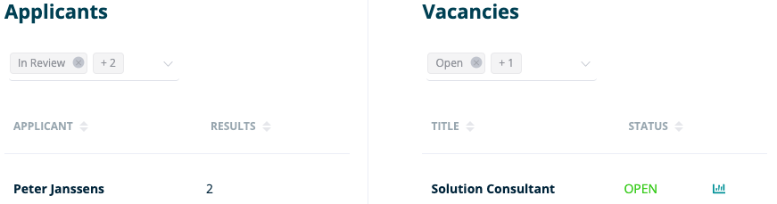
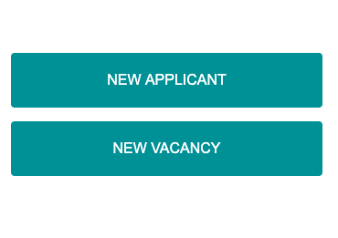
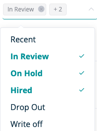
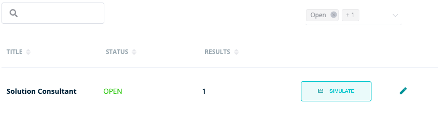
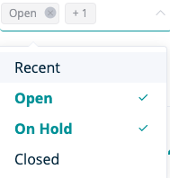
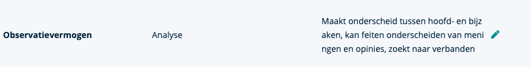

**Op deze pagina vind je een kort overzicht van de belangrijkste features van RQRY**
 



  

**Het dashboard geeft je een snel overzicht van:**
  

  

- **Kandidaten**: Je kan de kandidaten ordenen op status (in review, on hold,...) en je kan bekijken hoeveel resultaten van 
de respectievelijke kandidaten al zijn opgenomen in RQRY.
  

- **Vacatures**: Je kan bekijken wat de status (open, on hold,.. ) van je specifieke vacatures zijn en je krijgt
 de mogelijkheid om rechtstreeks naar de simulatiepagina voor een specifieke vacature te gaan.
   

- Verder krijg je ook de mogelijkheid om vanuit het dashboard direct nieuwe kandidaten of vacatures toe te voegen aan 
je organisationele RQRY.




  

**De applicants pagina geeft je een snel overzicht van:**

- Voornaam en achternaam
- E-mailadres
- Aantal resultaten per kandidaat

&nbsp;  

**Je krijgt de mogelijkheden op deze pagina om:**
  

- Bestaande kandidaten te filteren op status
- Bestaande kandidaten te ordenen op naam, e-mailadres en aantal resultaten
- Nieuwe kandidaten toe te voegen
- Bestaande kandidaten een of meerdere scores toe te kennen 
- Gegevens van een bestaande kandidaat aan te passen
  





  

  

**De vacancies pagina geeft je een snel overzicht van:**
  

- Vacaturetitels
- Huidige status van de vacature
- Totaal aantal resultaten per vacature
  
&nbsp;  

**Je krijgt de mogelijkheden om:**
  

- Bestaande vacatures te filteren op status
- Bestaande vacatures te ordenen op titel, status en aantal resultaten
- Nieuwe vacatures toe te voegen
- Simulaties te maken voor bestaande vacatures
- Bestaande vacatures te bewerken en up-to-date te brengen



 
  

&nbsp;  

**De skills pagina geeft je een snel overzicht van:**

- Titels van de skills
- Gerelateerde skills
- Gedragingen en vaardigheden van hoogpresterende werknemers

&nbsp;  

&nbsp;  

**Je krijgt de mogelijkheden om:**

- Nieuwe skills toe te voegen
- Bestaande skills aan te passen

&nbsp;  



