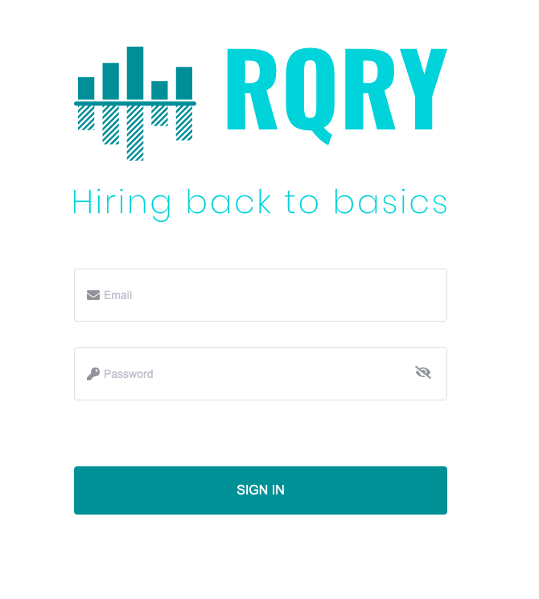
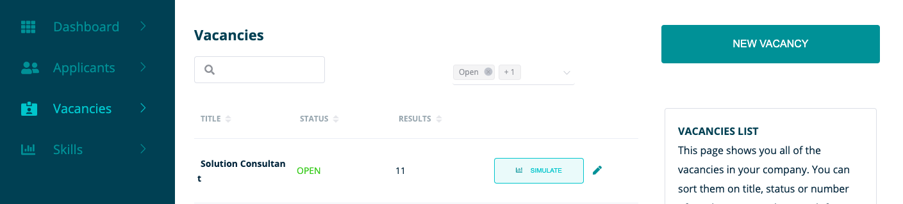
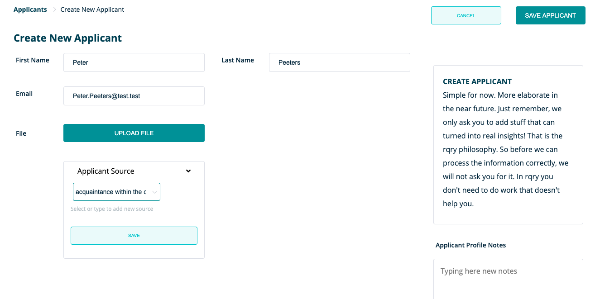

**On this page we will further discuss the possibilities of RQRY on the basis of a concrete example**



  **Please note that this is a purely fictional example and therefore cannot be used as an example for a vacancy in terms of content**


&nbsp;   

### First a brief clarification of what we will show in this tutorial:
&nbsp;   

**We would like to prepare a vacancy for a nurse (M / F / X) and score our candidates for this vacancy.**

&nbsp;   

### First we have to log in
&nbsp;   

We do this at **https://rqry.ai/auth/login/**, enter your email and password to log in.

&nbsp;   

&nbsp;   

### Check the organization for which you want to create the vacancy
&nbsp;   

After we log in, we end up on the dashboard. Here it is important that you ensure that you are on the RQRY page of the right organization.

&nbsp;   

&nbsp;   

You can check this in the top right corner at the arrow next to the name of your organization.
 There, you will get an overview of the RQRY pages of the different organizations
for which you are active. As you can see in the tutorial we are active for the organization **"sandbox"**.
So choose the relevant organization for which you want to create a vacancy.

&nbsp;   

&nbsp;   

Once we have chosen the right organization, we can start for real!
For this we will first check our skills that we need for the vacancy.

&nbsp;   

### Before creating the vacancy: check skills 

&nbsp;   

We will first check which skills we are searching for this vacancy and we will create one of these skills if it is not yet available in our list of skills on the 'Skills' page.

&nbsp;  

&nbsp;   

We see that our skill '**Responsibility**' cannot yet be found in the list and we will first create it via **'Create New Skill'**. 

&nbsp;

### Before creating the vacancy: create skills
&nbsp;   

We enter the name of the skill **_'Responsibility'_** and a skill related to this, namely **_'Embody the values'_**.
  Then we fill in the expected behavior of a high performer for this skill.

&nbsp;  

&nbsp;   

 
### Create vacancy: title + selection stages
&nbsp;   

&nbsp;   

Then we will create the vacancy effectively via **'New Vacancy'** on the **'Vacancies'** page where we give it the title **'Nurse (M / F / X)'** and determine which stages will be a part of the selection process.
We choose to have the selection process consist of a CV screening, interview and assessment. We delete the psychometric test out of the right column by clicking the cross.

&nbsp; 

&nbsp;   

### Create vacancy: skills
&nbsp;   

After we have given a title to the vacancy and decided which stages we want the selection process to include,
we have to determine which skills are required for the vacancy.
We will assign these skills to the 3 categories: **'must have'**, **'nice to have'** and **'mandatory'**.

In the example we choose the skills **'Responsibility'**  and **'Power of observation'**  as **'must haves'** and **'Embody the values'**  and **'Communication'**  as **'nice to haves'**. The **'mandatory'** is a **'Bachelor of Nursing'** .

&nbsp;   

&nbsp; 
 
### Create vacancy: skills weights and ranking
&nbsp;   

Once we have done this, we determine to what extent the **must haves** vs the **nice to haves** will weigh in the calculation
of the fit between the person and the vacancy and how heavy a certain skill weighs in a certain category by indicating a ranking. 

In this example we choose to have the **'must haves'** weighted for 70% and the **'nice to haves'** for 30%.
We also determine the underlying ranking within the categories, for example we choose within the **'nice to haves'**
to move **'Communication'** to 1st place and **'Embody the Values'** to 2nd place

For the **'must haves'** we choose to rank both skills equally high by indicating **'Equal to the previous one'**.
Finally, we also indicate the desired scores for the various skills within the **'Expected score'** box.

&nbsp;   

&nbsp; 

### Scoring candidate: control
&nbsp;   

We want to score a candidate for the different phases of the selection process. For this we must first check whether the candidate is already present in the list.
The candidate from our example is Peter Peeters, this candidate is not yet in our list on the **'Applicants'** page. We will therefore still have to create this candidate.

&nbsp;   

&nbsp;   

### Create candidate
&nbsp;   

We will now create a candidate profile on the **'Applicants'** page. We will then use this candidate profile to give the candidate a
score for the skills of the vacancy.

 
Our candidate is called Peter Peeters, has the e-mail address Peter.Peeters@test.test and at **applicant source** we write **'acquaintance within the company'**
since the candidate has been prescribed by an employee of our organization.

Furthermore, we did not receive a motivation letter, but if we did, we would have added it under **'Upload File'**.

We do not write anything for **'Applicant Profile Notes'** for the time being, as we have no comments about the candidate yet.

&nbsp;   

&nbsp;   

### Find candidate
&nbsp;   

After we have created the candidate profile, it will appear on the **'Applicants'** page. If the candidate does not appear immediately,
you may have to adjust the status filter at the top right of the list.

In the example, the list has been changed to **'Recent'** so that we filter our list on the most recently created candidates.

&nbsp;   

&nbsp;   

### Scoring candidate: new score
&nbsp;   

&nbsp;   

Once we have found our candidate in the list, we click on the button **'+ SCORE'** to add a score.
Then we get to see this, which means that we first have to determine for which vacancy we want to score the candidate.

&nbsp;   

&nbsp;   

After this, we give the candidate a score for the stage of the CV screening. Based on the CV, we score a 7 for **'Embody the values'** and **'Responsibility'**.

Since we do not yet possess enough information to make strong conclusions about the **Power of Observation** and  the candidate's **Communication** skills,
we leave the scores in the middle (somewhere between 4 and 6). We leave some remarks in the **'Recruitment Process Notes'** stating that additional attention is needed in subsequent phases for these skills.

&nbsp;   

### Simulation: interpretation of the fit between candidate and vacancy

&nbsp;   

&nbsp;   

After we have given the candidate a score, we can now simulate how well the candidate fits the vacancy. On the **'Vacancies'** page we press the button **'SIMULATE'**. We then see the simulation below.

&nbsp;   

&nbsp;   

We can view the **'skill profile scores'** of Peter Peeters by clicking on the blue dot in the left graph.

By hovering our mouse over the blue dot, we see a 85/100 fit between the candidate and the vacancy. With the **'skill profile scores'**
we can inspect how this fit score came about, by looking at how the candidate scores on the skills of the vacancy compared to the desired scores on these skills.

85/100 is a good fit, but since we've only done a CV screening for now, chances are that this value has been inflated. Further
phases will therefore have to indicate whether the initial fit score is confirmed

&nbsp;   

&nbsp;   

Finally, at the bottom of the page you can find a pie chart showing the extent to which the different skill scores
are included in the calculation of the fit score between candidate and vacancy.
