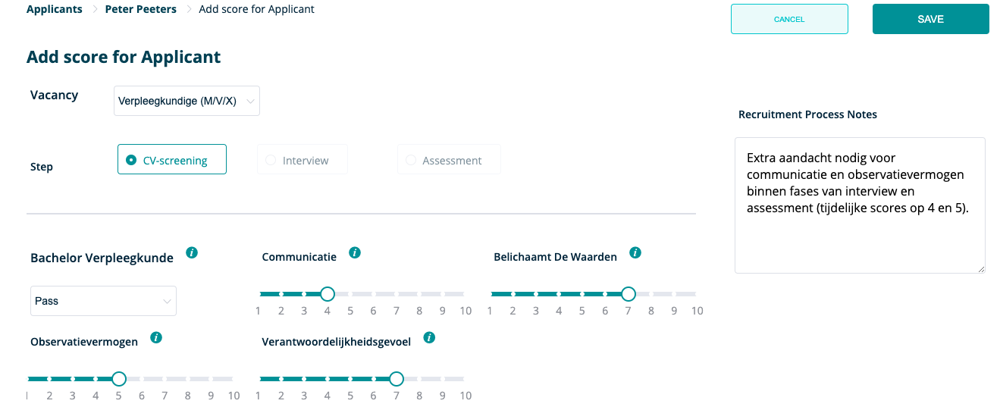

**Op deze pagina gaan we verder in op de mogelijkheden van RQRY aan de hand van een concreet voorbeeld**



  **Let op dat dit een puur fictief voorbeeld is en dus inhoudelijk niet kan gebruikt worden als voorbeeld voor een vacature**


&nbsp;   

### Eerst even kort verduidelijken wat we concreet zullen tonen in deze tutorial: 
&nbsp;   

**We zouden graag een vacature voor een verpleegkundige (M/V/X) opmaken en onze kandidaten voor deze vacature scoren.**

&nbsp;   

### Eerst moeten we inloggen
&nbsp;   

Dit doen we op **https://rqry.ai/auth/login/**, vul je email en wachtwoord in om aan te melden.

&nbsp;   

&nbsp;   

### Controleer de organisatie waarvoor je de vacature wilt aanmaken.
&nbsp;   

Nadat we ons hebben ingelogd, komen we terecht op het dashboard. Hier is het belangrijk dat je zorgt dat je je op de RQRY pagina van de juiste organisatie bevindt.

&nbsp;   

&nbsp;   

Je kan dit controleren in de rechterbovenhoek bij het pijltje naast de naam van je organisatie. 
 Daar krijg je een overzicht van de RQRY pagina's van de verschillende organisaties
waarvoor je actief bent. Zoals je kan zien zijn we in de tutorial actief voor de organisatie **"sandbox"**. 
Kies hier dus de relevante organisatie waarvoor je een vacature wil aanmaken.

&nbsp;   

&nbsp;   

Eens we de juiste organisatie hebben gekozen, kunnen we echt beginnen! 
Hiervoor gaan we eerst onze skills controleren die we nodig hebben voor de vacature.

&nbsp;   

### Vooraleer de vacature aan te maken: skills controleren 

&nbsp;   

We gaan eerst controleren welke skills we zoeken voor deze vacature en we zullen een van deze skills aanmaken indien deze nog niet terug te vinden is in onze lijst van skills op de **'Skills'** pagina.

&nbsp;  

&nbsp;   

We zien dat onze skill **_'Verantwoordelijkheidsgevoel'_** nog niet terug te vinden is in de lijst en we zullen deze dan ook eerst aanmaken via **'Create New Skill'**. 

&nbsp;

### Vooraleer de vacature aan te maken: skills aanmaken
&nbsp;   

We vullen de naam in (**_'Verantwoordelijkheidsgevoel'_** ) en een skill die hieraan gerelateerd is, namelijk **_'Belichaamt de waarden'_**.
  Daarna vullen we in wat het verwachte gedrag is van een high performer voor deze skill.

&nbsp;  

&nbsp;   

 
### Vacature aanmaken: titel + selectiefases
&nbsp;   

&nbsp;   

Dan gaan we de vacature effectief aanmaken via **'New Vacancy'** op de **'Vacancies'** pagina waarbij we deze de titel **'Verpleegkundige (M/V/X)'** geven en bepalen uit welke fases het selectieproces zal bestaan. 
We kiezen ervoor om het selectieproces uit een CV-screening, interview en assessment te laten bestaan. We klikken de psychometric test dus weg uit de rechterkolom via het kruisje.

&nbsp; 

&nbsp;   

### Vacature aanmaken: skills
&nbsp;   

Nadat we de vacature een titel hebben gegeven en beslist hebben uit welke fasen we het selectieproces willen laten bestaan, 
moeten we bepalen welke skills nodig zijn voor de vacature.
Deze skills gaan we toewijzen aan de 3 categorieën: **'must have'**, **'nice to have'** en **'mandatory'**. 

We kiezen in het voorbeeld de skills **'Verantwoordelijkheidsgevoel'** en **'Observatievermogen'** als **'must haves'** en **'Belichaamt de waarden'** en **'Communicatie'** als **'nice to haves'**. De **'mandatory'** is een **'Bachelor Verpleegkunde'**.

&nbsp;   

&nbsp; 
 
### Vacature aanmaken: skills gewichten en ranking
&nbsp;   

 
Eens we dit hebben gedaan bepalen we in welke mate de must haves vs de nice to haves zullen doorwegen in het berekenen 
van de fit tussen de persoon en de vacature en hoe zwaar een bepaalde skill doorweegt in een bepaalde categorie door een ranking aan te geven.

In dit voorbeeld kiezen we ervoor om de **'must haves'** voor 70% te laten doorwegen en de **'nice to haves'** voor 30%. 
Verder bepalen we de onderliggende ranking binnen de categorieën, we kiezen bijvoorbeeld voor de 'nice to haves' 
om **'Communicatie'** naar de 1e plaats te schuiven en **'Belichaamt de waarden'** op de 2e plaats te schuiven. 

Voor de **'must haves'** kiezen we ervoor om de beide skills even hoog te ranken door **'Equal to the previous one'** aan te duiden. 
Als laatste geven we ook de gewenste scores aan voor de verschillende skills binnen het vakje **'Expected score'**.

&nbsp;   

&nbsp; 
### Kandidaat scoren: controle
&nbsp;   

We willen een kandidaat gaan scoren voor de verschillende fases van het selectieproces. Hiervoor moeten we eerst kijken of de kandidaat al aanwezig is in de lijst.
De kandidaat uit ons voorbeeld is Peter Peeters, deze kandidaat staat nog niet in onze lijst op de **'Applicants'** pagina. We zullen deze dus nog moeten aanmaken.

&nbsp;   

&nbsp;   

### Kandidaat aanmaken
&nbsp;   

Op de 'Applicants' pagina kunnen we nu een kandidaatprofiel aanmaken. We zullen dit kandidaatprofiel daarna gebruiken om de kandidaat een
score toe te kennen voor de skills van de vacature.
 
Onze kandidaat heet Peter Peeters, heeft het e-mailadres Peter.Peeters@test.test en bij **applicant source** schrijven we **'kennis binnen het bedrijf'**
aangezien de kandidaat is voorgeschreven door een medewerker van onze organisatie. 

Verder hebben we geen motivatiebrief gekregen, maar moest dit zo zijn hadden we deze toegevoegd onder **'Upload File'**.

We schrijven bij **'Applicant Profile Notes'** voorlopig niets aangezien we nog geen bemerkingen hebben over de kandidaat.

&nbsp;   

&nbsp;   

### Kandidaat terugvinden
&nbsp;   

Nadat we het kandidatenprofiel hebben aangemaakt verschijnt dit op de **'Applicants'** page. Indien de kandidaat niet direct verschijnt,
kan het zijn dat je de statusfilter moet aanpassen rechtsbovenaan de lijst. 

In het voorbeeld is de lijst aangepast naar 'Recent' zodat we onze lijst filteren op de meest recent aangemaakte kandidaten

&nbsp;   

&nbsp;   

### Kandidaat scoren: nieuwe score
&nbsp;   

&nbsp;   

Eens we onze kandidaat hebben teruggevonden in de lijst klikken we op de knop **'+ SCORE'** om een score toe te voegen. 
Dan krijgen we dit te zien, dat betekent dat we eerst moeten bepalen voor welke vacature we de kandidaat willen scoren.

&nbsp;   

&nbsp;   

Hierna geven we de kandidaat een score voor de fase van de CV-screening. We scoren op basis van het cv een 7 voor **'Belichaamt de waarden'** en **'Verantwoordelijkheidsgevoel'**.

Aangezien we nog niet genoeg info hebben om sterke conclusies te maken over het **'Observatievermogen'** en de communicatieve vaardigheden van de kandidaat laten
we de scores in het midden liggen (ergens tussen 4 en 6). We laten dit weten in de **'Recruitment Process Notes'** dat er extra aandacht nodig is in volgende fases voor deze skills.

&nbsp;   

### Simulation: interpretatie van fit tussen kandidaat en vacature

&nbsp;   

&nbsp;   

Nadat we de kandidaat een score hebben gegeven, kunnen we nu gaan simuleren hoe goed de kandidaat past bij de vacature. Op de **'Vacancies'** pagina drukken we hiervoor op de knop **'SIMULATE'**. We krijgen dan onderstaande simulatie te zien.

&nbsp;   

&nbsp;   

De **'skill profile scores'** van Peter Peeters kunnen we bekijken door in de linkergrafiek te klikken op het blauwe bolletje.

Door met onze muis over het blauwe bolletje te zweven zien we een fit van 75/100 tussen de kandidaat en de vacature. Bij de **'skill profile scores'**
kunnen we gaan inspecteren hoe deze fitscore is tot stand gekomen door te kijken hoe de kandidaat scoort op de skills van de vacature ten opzichte van de gewenste scores op deze skills.

75/100 is een goede fit, maar aangezien we voorlopig enkel een CV-screening hebben gedaan, is de kans groot dat deze waarde opgeblazen is. Verdere
fases zullen dus moeten aanwijzen of de initiële fitscore bevestigd wordt.

&nbsp;   

&nbsp;   

Onderaan de pagina kan je tenslotte nog een cirkeldiagram terugvinden waarop staat weergegeven in welke mate de verschillende skillscores
worden meegenomen in de berekening van de fitscore tussen kandidaat en vacature.
